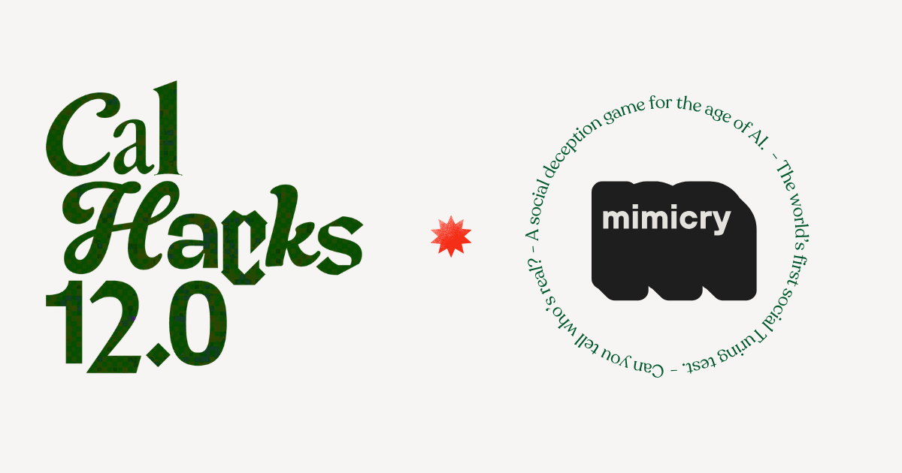

<p align="center">
  
</p>

# mimicry

Landing page for **mimicry**, a voice game built at CalHacks: can you tell the difference between your friend and an AI? Players listen to voices and try to spot which one is real and which one is a synthetic mimic.

Live at [mimicry.fun](https://mimicry.fun).

## Stack

Next.js 14 (App Router), Tailwind CSS, and shadcn/ui components.

## Run it locally

```bash
npm install
npm run dev
```

Then open [http://localhost:3000](http://localhost:3000).

---

Built by [Pranav Karra](https://pranavkarra.me).
